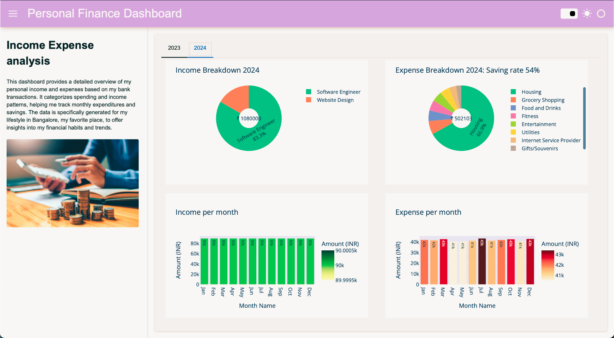

# **Project Name: Personal Finance Dashboard**

## **Description:**
This project is designed to generate and categorize personal financial transactions and visualise them through an interactive dashboard. It comprises multiple steps:

1. **Generate Transaction Data:** The `generate_transactions.py` script creates a CSV file (`Transactions_2023-24.csv`) that contains random income and expense transactions. These transactions are generated based on the user's favorite places in Bangalore, reflecting real-life spending patterns.

2. **Categorize Transactions:** The `categorize_expenses.py` notebook categorizes the generated transactions into categories like "Salary," "Entertainment," "Food and Drinks," etc., using a Local Language Model (LLM) – Ollama2.

3. **Visualize Data in Dashboard:** The `dashboard.ipynb` file takes the categorized transactions and displays them in an interactive dashboard using Plotly and Panel, providing a visual analysis of the user's income and expenses.

---

## **Installation and Setup Instructions:**

### **Step 1: Install Local LLM (Ollama2)**

This project utilizes **Ollama2**, a local Language Model (LLM) to automatically categorize transaction names. The use of a local LLM ensures that all data remains private and secure since it operates entirely on your local machine without sending any information to the cloud.

**Why Local LLMs?**
- **Data Privacy:** No need to send sensitive financial data over the internet, ensuring full control over your information.
- **Faster Execution:** Local models avoid network latency, allowing for faster processing and responses.
- **Cost Efficiency:** Using a local model avoids cloud API usage fees and provides continuous access without any external dependencies.

To install Ollama2 on your machine, follow these steps:

1. **Download Ollama2** from the official website: [https://ollama.com](https://ollama.com)
2. **Install Ollama2** by following the platform-specific instructions (Windows, Mac, or Linux).

   After installation, you can verify it by running:
   ```bash
   ollama --version
   ```

3. Once installed, ensure Ollama2 is properly set up in your environment.

---

### **Step 2: Clone the Repository**

Clone this repository to your local machine:

```bash
git clone <repository-url>
cd <repository-folder>
```

---

### **Step 3: Run the Notebooks in Sequence**

1. **Generate Transaction Data:**

   - Run the `generate_transactions.py` notebook to generate a CSV file (`Transactions_2023-24.csv`). This file will contain random transactions that reflect spending patterns in Bangalore (e.g., restaurants, supermarkets, utilities).

2. **Categorize the Transactions:**

   - After generating the data, run the `categorize_expenses.py` notebook. This file uses the **Ollama2 LLM** to categorize the transactions into predefined categories like "Income," "Entertainment," and "Food and Drinks." The output is saved into two files: `Categories_df_all.csv` and `Categorized_transactions.csv`.

   **Note:** Ensure that Ollama2 is running on your local machine before executing this notebook, as it is used for transaction categorization.

3. **Visualize the Categorized Data:**

   - Finally, run the `dashboard.ipynb` notebook to visualize the categorized transactions in an interactive dashboard. It generates pie charts and bar charts for both income and expenses, helping you analyze your financial trends over 2023 and 2024.

---

## **Usage Instructions:**

1. **Running the Transaction Data Generator:**
   - Use the `generate_transactions.py` notebook to create the raw transaction data file (`Transactions_2023-24.csv`).
   
2. **Categorizing the Transactions:**
   - Use `categorize_expenses.py` to categorize the transactions into predefined categories. Ensure the Ollama2 local LLM is set up and running.

3. **Visualizing the Data:**
   - Use `dashboard.ipynb` to visualize your categorized income and expenses with interactive charts and graphs. The dashboard will display income and expense data in a user-friendly manner.

---

## Dashboard Screenshot


---

## **Contributing:**

Feel free to fork the repository and contribute to the project. Suggestions for improving the transaction categorization, enhancing the dashboard, or adding new visualizations are welcome!

---

## **License:**

This project is open-source and licensed under the MIT License.
